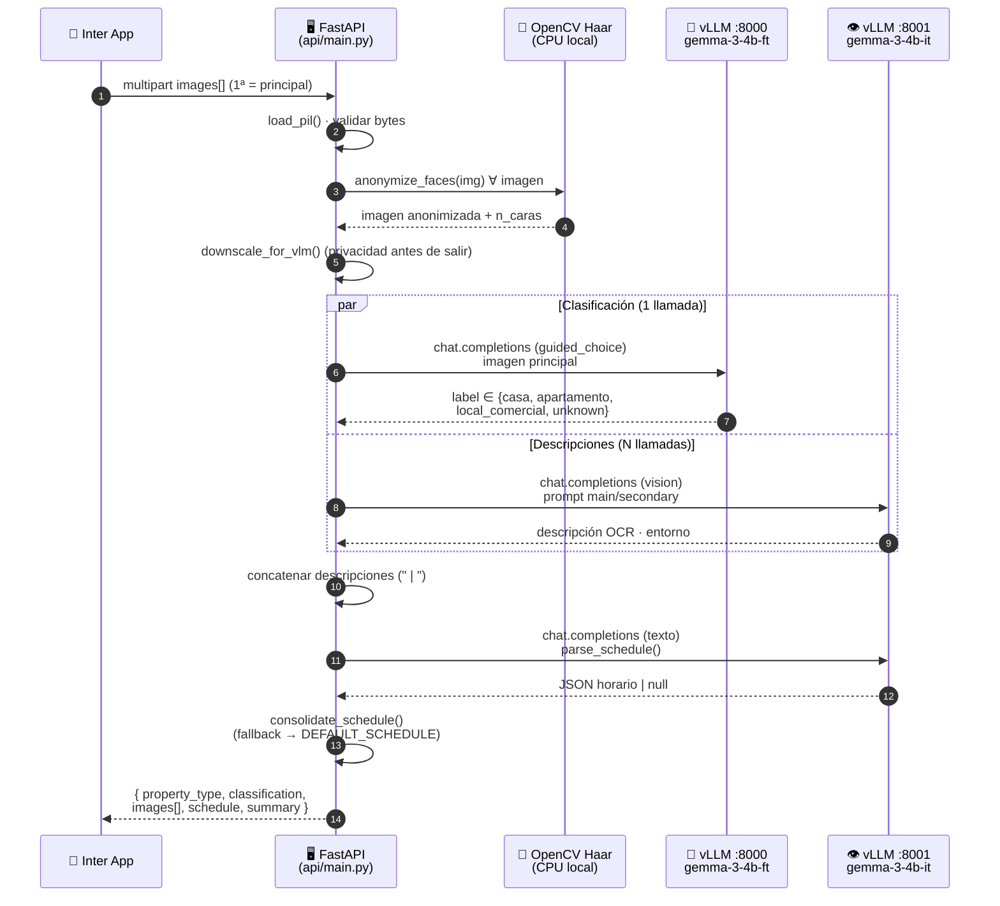
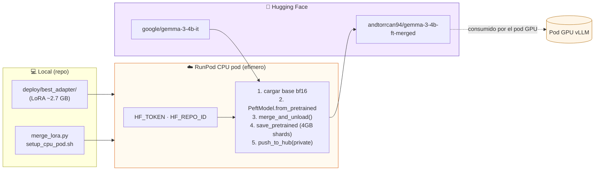
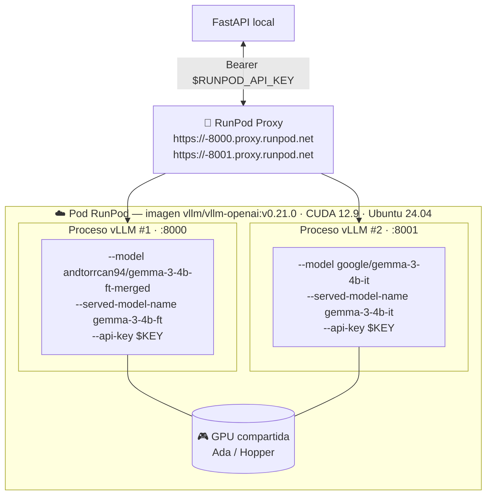
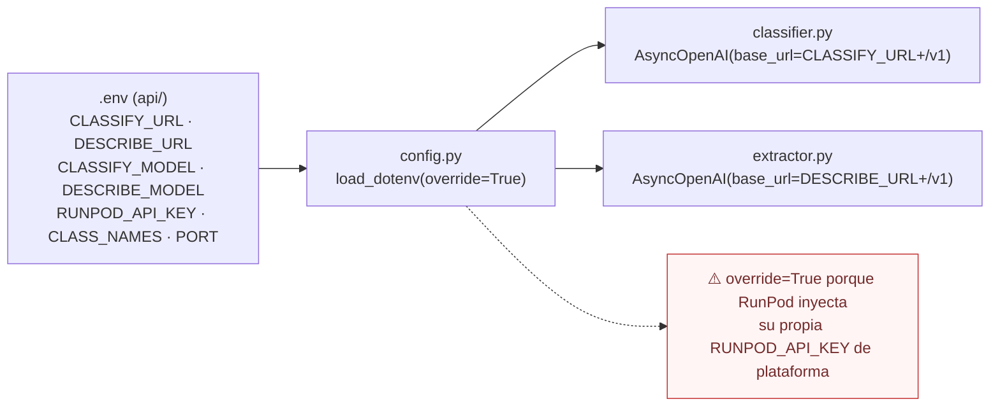
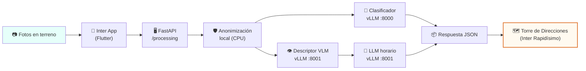

# Arquitectura y Despliegue

Sistema de **clasificación de inmuebles** y **asignación de horarios de operación** para Inter Rapidísimo. Compone una API local de orquestación (FastAPI) con un pod GPU en RunPod que sirve dos procesos vLLM (clasificador fine-tuned + base multimodal).

---

## 1. Visión general (componentes)

```mermaid
flowchart LR
    subgraph Client["📱 Cliente"]
        App["Inter App<br/>(Flutter — domiciliario)"]
    end

    subgraph Local["🖥️ API local · FastAPI :8080"]
        direction TB
        EP["POST /processing"]
        ANON["anonymizer.py<br/>OpenCV Haar (CPU)"]
        IMG["images.py<br/>downscale + base64"]
        CLS["classifier.py<br/>cliente OpenAI"]
        EXT["extractor.py<br/>VLM desc. + LLM horario"]
        CONF["config.py<br/>(.env)"]
        EP --> ANON --> IMG
        IMG --> CLS
        IMG --> EXT
        CONF -.-> CLS
        CONF -.-> EXT
    end

    subgraph Pod["☁️ RunPod GPU · vllm/vllm-openai:v0.21.0"]
        direction TB
        VLLM1["vLLM :8000<br/><b>gemma-3-4b-ft</b><br/>(fine-tune · guided_choice)"]
        VLLM2["vLLM :8001<br/><b>gemma-3-4b-it</b><br/>(base multimodal SigLIP)"]
    end

    subgraph HF["🤗 Hugging Face Hub"]
        REPO1["andtorrcan94/gemma-3-4b-ft-merged<br/>(privado)"]
        REPO2["google/gemma-3-4b-it"]
    end

    App -- "multipart<br/>images[]" --> EP
    CLS  -- "OpenAI API · :8000/v1<br/>chat.completions" --> VLLM1
    EXT  -- "OpenAI API · :8001/v1<br/>chat.completions (vision + text)" --> VLLM2

    VLLM1 -. "pull en cold start" .-> REPO1
    VLLM2 -. "pull en cold start" .-> REPO2

    EP -- "JSON consolidado" --> App

    classDef local fill:#E8F4FD,stroke:#2B6CB0,color:#1A365D;
    classDef pod   fill:#FEF5E7,stroke:#B7791F,color:#744210;
    classDef hf    fill:#F3E8FF,stroke:#6B46C1,color:#44337A;
    classDef cli   fill:#E6FFFA,stroke:#2C7A7B,color:#234E52;
    class EP,ANON,IMG,CLS,EXT,CONF local;
    class VLLM1,VLLM2 pod;
    class REPO1,REPO2 hf;
    class App cli;
```

| Capa | Responsabilidad | Tecnología |
|---|---|---|
| **Cliente** | Captura fotos del inmueble en terreno | Flutter (Inter App) |
| **API local** | Orquestación, anonimización, pre/post-proceso | FastAPI + OpenCV + Pillow |
| **Pod GPU** | Inferencia VLM/LLM compatible OpenAI | vLLM 0.21 sobre CUDA 12.9 |
| **HF Hub** | Distribución de pesos (fine-tune mergeado + base) | Hugging Face |

---

## 2. Pipeline de una request `POST /processing`

> **Privacidad first**: la anonimización ocurre **antes** del downscale y **antes** de cualquier salida hacia el pod GPU. Ninguna cara sin difuminar viaja a la red externa.

---

## 3. Despliegue — preparación del modelo (one-shot)

Antes del pod GPU hay un paso *one-shot* que mergea el adapter LoRA con la base y lo publica en HF.

**Por qué un pod CPU para el merge:** el merge no requiere GPU (~10–15 min en CPU) y evita pagar GPU mientras solo se copian pesos. El cuello de botella es la descarga del base (~9 GB).

---

## 4. Topología del pod GPU (runtime)

| Proceso | Puerto | `--model` | `--served-model-name` | Uso |
|---|---|---|---|---|
| Clasificador (fine-tune) | `8000` | `andtorrcan94/gemma-3-4b-ft-merged` | `gemma-3-4b-ft` | `guided_choice` → 1 palabra exacta |
| Base (multimodal) | `8001` | `google/gemma-3-4b-it` | `gemma-3-4b-it` | Descripción OCR · parse horario |

Ambos procesos comparten **la misma API key** que la FastAPI expone como `RUNPOD_API_KEY` en su `.env`.

---

## 5. Configuración y secretos

---

## 6. Resumen de flujo end-to-end

> **Resultado de negocio**: enriquece la Torre de Direcciones con tipo de inmueble + horario, reduciendo el 15–20 % de fallos evitables de entrega por horario o tipo incorrecto.
